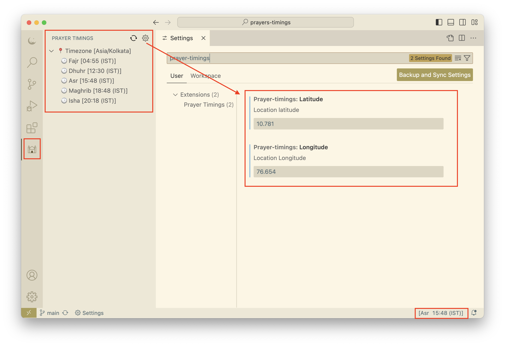

# Prayer Timings Extension
Stay connected to your faith while you code with the Prayer Timings extension for Visual Studio Code. This extension provides accurate prayer times for your location directly within your favorite code editor, ensuring you never miss a prayer, no matter how engrossed you are in your work.

Prayer Timing.

## Features:
### Accurate Prayer Times: 
Get precise prayer timings based on your location, including Fajr, Dhuhr, Asr, Maghrib, and Isha.
### Minimalist Design: 
Simple and intuitive user interface that integrates seamlessly with Visual Studio Code.
### Prayer Time Alerts: 
Upcomming Prayer alerts

## How to Use:
1. Install the Extension: Search for "Prayer Timings" in the Visual Studio Code marketplace and click install.
2. Click the ⚙ [settings] button
3. Fill the latitude and  logitude fields
4. Click Refresh Button

